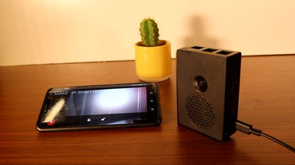
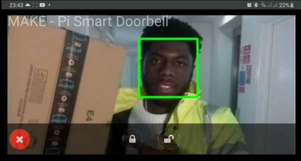
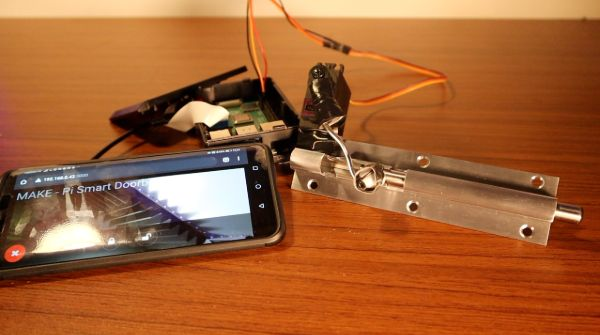

# Raspberry Pi - Smart DoorBell

Create your own Smart Doorbell live stream camera, and keep an eye out at who's at your door. 
Features: 
- A Motor interactiotion to lock and unlock doors from your phone / client device(s). 
- Basic Face Detection based on the Haardcascade xml models.

## How it works
Based on the previous [Pi Stream Camera Project.](https://github.com/EbenKouao/pi-camera-stream-flask)
The Pi streams the output of the camera module over the web via Flask. Devices connected to the same network would be able to access the camera stream via

```
<raspberry_pi_ip:5000> 
```
## Configuring Face Detection Camera Stream

This repo provides other(real world) use cases such as a face detection based on the [Haarcascade Model](https://github.com/opencv/opencv/tree/master/data/haarcascades). This works integrates with the Pi Stream and the ability to interact with the Door Lock / Unlock Mechanism.

/face-detection-example - Move/Replace the following files to the parent directory
main.py
camera.py
haarcascade_frontalface_alt2.xml

Note: Change the xml models to suit your needs e.g. [haarcascade_fullbody.xml](https://github.com/opencv/opencv/blob/master/data/haarcascades/haarcascade_fullbody.xml)

## Screenshots
|  |  |
|---|---|---|
| Pi Setup | Pi - Live Stream | Door Lock System

## Preconditions

* Raspberry Pi 4, 2GB is recommended for optimal performance. However you can use a Pi 3 or older, you may see a increase in latency.
* Raspberry Pi 4 Camera Module or Pi HQ Camera Module (Newer version)
* Python 3 highly recommended.

## Library dependencies
Install the following dependencies to create camera stream.

```
sudo apt-get update 
sudo apt-get upgrade

sudo apt-get install libatlas-base-dev
sudo apt-get install libjasper-dev
sudo apt-get install libqtgui4 
sudo apt-get install libqt4-test
sudo apt-get install libhdf5-dev

sudo pip3 install flask
sudo pip3 install numpy
sudo pip3 install opencv-contrib-python
sudo pip3 install imutils
sudo pip3 install opencv-python
```


## Step 1 – Cloning Raspberry Pi Camera Stream
Open up terminal and clone the Camera Stream repo:

```
cd /home/pi
git clone https://github.com/EbenKouao/pi-camera-stream-flask.git
```

## Step 2 – Launch Web Stream

Note: Creating an Autostart of the main.py script is recommended to keep the stream running on bootup.
```bash cd modules
sudo python3 /home/pi/pi-smart-doorbell/main.py
```

## Step 3 – Autostart your Pi Stream

Optional: A good idea is to make the the camera stream auto start at bootup of your pi. You will now not need to re-run the script every time you want to create the stream. You can do this by going editing the /etc/profile to:

```
sudo nano /etc/profile
```

Go the end of the and add the following (from above):

```
sudo python3 /home/pi/pi-smart-doorbell/main.py
```
This would cause the following terminal command to auto-start each time the Raspberry Pi boots up. This in effect creates a headless setup - which would be accessed via SSH. 
Note: make sure SSH is enabled.

